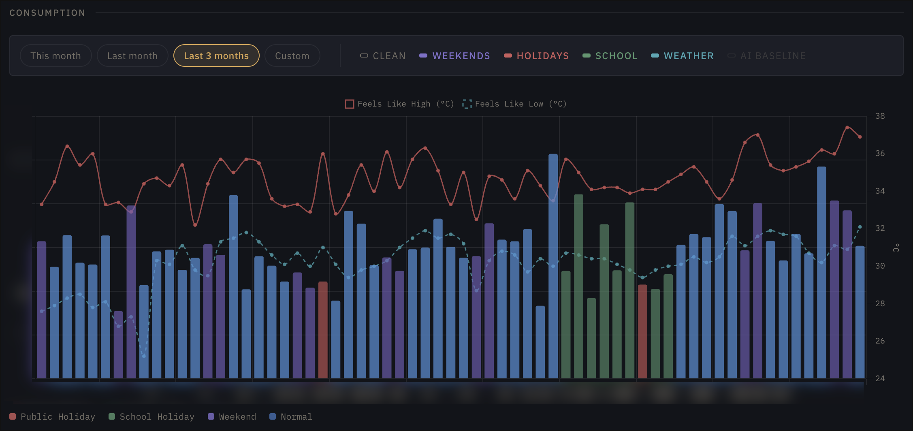

# Enhanced Utilities Tracker

A self-hosted analytics dashboard for Brunei's SmartMeter accounts. Provides daily consumption analytics, balance forecasting, weather correlation, and AI-powered appliance estimation from your SmartMeter account.



## What it does

- **Daily consumption chart** — bar chart colored by day type (weekday, weekend, public holiday, school holiday) with weather temperature overlay
- **Balance forecast** — projects when your prepaid balance will run out based on recent usage patterns
- **Cost projection** — "at this pace, your monthly bill will be BND X"
- **Usage patterns** — day-of-week heatmap showing when you use the most
- **Weather correlation** — scatter plot of consumption vs. temperature (quantifies your AC impact)
- **Anomaly detection** — flags unusual consumption days (>2 standard deviations from your baseline)
- **Water tank sizing** — estimates tank capacity needed for emergency water storage
- **AI appliance estimator** — describe your appliances, get a per-appliance cost breakdown (optional, requires OpenRouter API key)
- **Electricity + water** — supports both meter types from a single account

## How it works

The backend uses Playwright (headless Chromium) to log into the SmartMeter portal, navigate the ASP.NET WebForms UI, and extract data from the Daily consumption report's Data View table. Results are cached in SQLite so subsequent loads are instant.

Weather data comes from [Open-Meteo](https://open-meteo.com) (free, no API key needed).

## Quick start

### Prerequisites

- [Docker](https://docs.docker.com/get-docker/) and Docker Compose
- A SmartMeter account (IC number + password)

### Setup

```bash
git clone https://github.com/your-username/utilities-tracker.git
cd utilities-tracker

# Configure your credentials
cp .env.example .env
# Edit .env and fill in your USMS_IC and USMS_PASSWORD

# Start
docker compose up
```

Open [http://localhost:3002](http://localhost:3002). The first load takes 10–15 seconds while the backend logs in and fetches your meter data.

### Environment variables

| Variable | Required | Default | Description |
|----------|----------|---------|-------------|
| `USMS_IC` | Yes | — | Your IC number (with or without dashes, e.g. `01-234567`) |
| `USMS_PASSWORD` | Yes | — | Your SmartMeter password |
| `APP_PIN` | No | — | PIN to protect the dashboard (leave blank for no PIN) |
| `OPENROUTER_API_KEY` | No | — | Enables AI appliance estimator. Get a free key at [openrouter.ai](https://openrouter.ai) |
| `OPENROUTER_MODEL` | No | `qwen/qwen3-235b-a22b-2507` | AI model to use via OpenRouter |
| `USMS_BASE_URL` | No | `https://www.usms.com.bn` | Override the portal base URL (for testing) |

When `APP_PIN` is set, the dashboard shows a PIN entry screen before granting access. Rate-limited to 10 attempts per 15 minutes per IP (constant-time comparison to prevent timing attacks). When not set, the dashboard is open.

When `OPENROUTER_API_KEY` is not set, AI features are hidden from the UI automatically.

## Features in detail

### Consumption chart

Daily bars for up to 1 month of data. Toggle overlays:

- **Weekends** — purple bars for Saturday/Sunday
- **Holidays** — red bars for Brunei public holidays
- **School** — green bars for school holiday periods
- **Weather** — temperature lines (feels-like high/low) from Open-Meteo on a secondary axis
- **AI Baseline** — dashed line showing your estimated daily usage from the AI appliance model

Date presets: This month, Last month, Last 3 months (fires 3 parallel requests), or custom range.

### Balance forecast

Uses your last 3 months of daily consumption to project:
- Estimated depletion date with confidence band (±1 standard deviation)
- Monthly cost at current usage rate
- Timeline bar showing balance burned since last top-up

### Insights

| Insight | What it shows |
|---------|---------------|
| **Usage Patterns** | Average consumption by day of week. Weekend vs weekday comparison with percentage difference. |
| **Weather Correlation** | Scatter plot of daily kWh vs feels-like temperature. Linear regression slope tells you how much each degree costs. |
| **Anomaly Detector** | Days with consumption >2 standard deviations from your mean. For water meters, flags potential slow leaks. |
| **Cost Projection** | Current-month pace projection: "at this rate, BND X this month." Progress bar for days elapsed. |

### Water tank estimator

For water meters only. Two modes:
- **Tank size → coverage**: pick a tank (500L, 1kL, 2kL, 5kL, or custom) and see how many days it lasts
- **Coverage → tank size**: pick a target (1, 3, 7, 14, 30 days) and see what tank you need

### AI appliance estimator

Describe your appliances in plain text (e.g. "3 aircons running 9 hours/day, 1 fridge, washing machine 5x/week"). The AI returns a per-appliance breakdown with estimated kWh/month and cost.

Requires `OPENROUTER_API_KEY` in `.env`. Uses Gemini 2.0 Flash by default (fast, cheap). Override the model with `OPENROUTER_MODEL`.

## Development

### Local dev (without Docker)

```bash
# Backend
cd backend
npm install
npx playwright install chromium
npm run dev   # Express on port 4000

# Frontend (separate terminal)
cd frontend
npm install   # or pnpm install
npm run dev   # Vite on port 3002
```

Create a `.env` file in the project root with your credentials. The Vite dev server proxies `/api/*` to `localhost:4000`.

### Running tests

```bash
cd backend
npm test
```

Tests use Vitest and run against HTML fixtures (no live portal calls in CI).

## Tech stack

| Layer | Technology |
|-------|-----------|
| Frontend | React 18, TypeScript, Vite 8, Tailwind CSS 3.4, Chart.js 4 |
| Backend | Express 4, TypeScript, Playwright (Chromium), Cheerio, ExcelJS |
| Cache | SQLite (better-sqlite3, WAL mode) |
| AI | OpenRouter API (configurable model) |
| Weather | Open-Meteo (free, no key, called from browser) |
| Deployment | Docker Compose (Nginx + Node on Playwright base image) |

### Architecture

```
Browser (React)
  ├── localhost:3002 ──→ Nginx (static files + /api proxy)
  │                         └── /api/* ──→ Express backend (port 4000)
  │                                           ├── Playwright (Chromium) ──→ SmartMeter portal
  │                                           ├── SQLite cache (/data volume)
  │                                           └── OpenRouter API (optional)
  └── Open-Meteo API (weather, direct from browser)
```

The backend maintains a single Playwright browser instance with per-session contexts. Login cookies are reused across requests. Sessions auto-refresh every 20 minutes.

## Data & privacy

- Your credentials are stored only in your local `.env` file and used server-side to authenticate with the SmartMeter portal. They are never logged, never sent to any third party, and never exposed to the frontend.
- If AI features are enabled, your average monthly consumption and appliance descriptions are sent to OpenRouter. No credentials or personal identifiers are included.
- All cached data stays in a local SQLite file (`./data/cache.db`) on your machine.
- Weather data is fetched from Open-Meteo using Brunei's coordinates. No personal data is sent.

## Limitations

- **Daily data only** — the SmartMeter portal exposes daily consumption (max 1 month per request). Hourly data exists but is disabled on the portal.
- **Scraping fragility** — the backend scrapes an ASP.NET WebForms site with DevExpress controls. If the portal UI changes, the scraper may break.
- **Single user** — designed for one household. The backend authenticates with one set of credentials from `.env`.
- **No push notifications** — you need to open the dashboard to see your data.

## Author

**Izdihar Sulaiman** — [izdiwho.com](https://izdiwho.com)

- [GitHub](https://github.com/izdiwho)
- [LinkedIn](https://www.linkedin.com/in/izdihar-sulaiman)
- [Blog](https://notes.izdiwho.com/)
- [Buy Me a Coffee](https://buymeacoffee.com/izdiwho/)

## License

[MIT](LICENSE)

## Acknowledgments

- [SmartMeter portal](https://www.usms.com.bn/SmartMeter/) — upstream data source
- [Open-Meteo](https://open-meteo.com) — free weather API
- [OpenRouter](https://openrouter.ai) — AI model gateway
